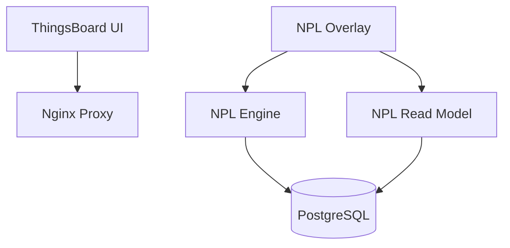

# ThingsBoard NPL Modernization

This project modernizes ThingsBoard's device management by replacing its Java/Spring Boot implementation with NPL (NOUMENA Protocol Language) protocols.

## Project Status

✅ = Completed
🔄 = In Progress
⏳ = Planned

### Core Implementation
- ✅ NPL DeviceManagement protocol
- ✅ NPL Read Model with GraphQL API
- ✅ Frontend integration via proxy pattern
- 🔄 Device operations implementation
- ⏳ Real-time updates via GraphQL subscriptions

### Documentation
- ✅ [Frontend Integration](docs/FRONTEND_INTEGRATION.md)
- ✅ [NPL Read Model Analysis](docs/NPL_READ_MODEL_CAPABILITY_ANALYSIS.md)
- ✅ [Modernization Methodology](docs/NPL_MODERNIZATION_METHODOLOGY.md)

## Quick Start

### Prerequisites
- Docker & Docker Compose
- Node.js 16+ (for overlay development)
- Angular CLI 13 (for overlay development)

### Running the Stack
```bash
# Start all services
docker-compose up -d

# Access ThingsBoard with NPL overlay
open http://localhost:8081

# Default credentials
# Tenant Admin: tenant@thingsboard.org / tenant
# System Admin: sysadmin@thingsboard.org / sysadmin
# Customer: customer@thingsboard.org / customer
```

### Development

#### Building the Overlay
```bash
cd frontend-overlay
npm install
ng build
```

#### Project Structure
```
npl-modernization/
├── api/                    # NPL protocols
├── docs/                   # Documentation
├── frontend-overlay/       # Angular overlay
├── nginx-proxy.conf        # Nginx configuration
└── docker-compose.yml      # Stack orchestration
```

## Architecture



## Next Steps

1. Test and validate GraphQL queries via NPL Read Model
2. Complete remaining device operations
3. Implement error handling and loading states
4. Add real-time updates via GraphQL subscriptions
5. Performance testing and optimization

## Contributing

1. Create a feature branch
2. Make your changes
3. Submit a pull request

## License

This project is licensed under the same terms as ThingsBoard.
