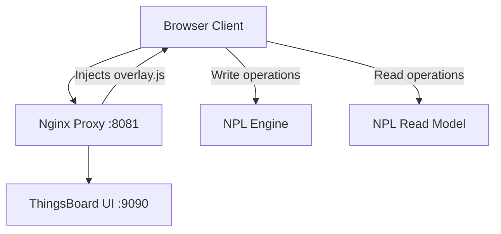

# Frontend Integration Progress

## Current Implementation

### Architecture
We've implemented a non-invasive frontend integration using a Reverse Proxy Pattern:

1. **Original ThingsBoard UI** remains untouched, running in Docker (`thingsboard/tb-postgres` image)
2. **NPL Overlay** implemented as a separate Angular bundle
3. **Nginx Proxy** injects our overlay into ThingsBoard's UI



### Components
- `npl-modernization/frontend-overlay/`: Independent Angular-13 workspace
  - HTTP Interceptor for request routing
  - NPL Engine client service
  - GraphQL service for Read Model
  - Request transformer service
  - Apollo client configuration

### Docker Integration
```yaml
services:
  mytb:
    image: thingsboard/tb-postgres
    ports:
      - "9090:9090"
    # ... other configs ...

  npl-proxy:
    image: nginx:alpine
    ports:
      - "8081:8081"
    volumes:
      - ./nginx-proxy.conf:/etc/nginx/nginx.conf:ro
      - ./overlay:/usr/share/nginx/html/overlay:ro
```

### Access Points
- Original ThingsBoard UI: http://localhost:9090
- NPL-enabled UI: http://localhost:8081
- Same credentials for both:
  - Tenant Admin: tenant@thingsboard.org / tenant
  - System Admin: sysadmin@thingsboard.org / sysadmin
  - Customer: customer@thingsboard.org / customer

## Implementation Details

### Overlay Bundle
The NPL modernization overlay is implemented as a separate Angular bundle that:
1. Bootstraps when ThingsBoard UI loads
2. Accesses ThingsBoard's root injector
3. Registers HTTP interceptors
4. Sets up GraphQL client

### Request Routing
- **Write Operations**: Routed to NPL Engine REST API
- **Read Operations**: Transformed into GraphQL queries to NPL Read Model
- **Legacy Operations**: Passed through to ThingsBoard

### Proxy Configuration
```nginx
server {
    listen 8081;
    
    location / {
        proxy_pass http://mytb:9090;
        sub_filter '</body>' '
            <script src="assets/overlay/npl-overlay.js" defer></script>
        </body>';
        sub_filter_once on;
    }
    
    location /assets/overlay/ {
        alias /usr/share/nginx/html/overlay/;
    }
}
```

## Development Workflow

### Building the Overlay
```bash
cd npl-modernization/frontend-overlay
npm install
ng build
```

### Deployment
The overlay bundle is automatically mounted into the Nginx proxy container via Docker volumes.

### Testing
1. Start the stack: `docker-compose up -d`
2. Access UI at http://localhost:8081
3. Login as tenant admin
4. Create/modify devices to test integration

## Next Steps
1. ⏳ Test GraphQL queries via NPL Read Model
2. ⏳ Implement remaining device operations
3. ⏳ Add error handling and loading states
4. ⏳ Implement real-time updates via GraphQL subscriptions 