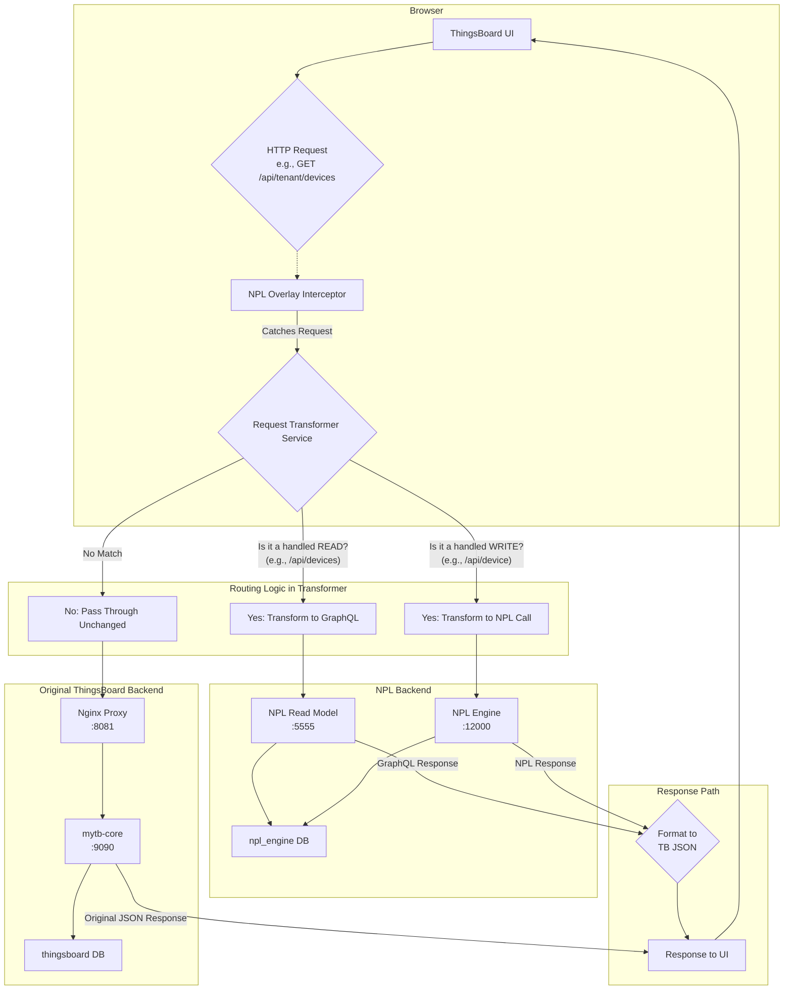

# Hybrid NPL-ThingsBoard Architecture

## Architectural Principles

Given NPL's strengths (protocols, business logic, state management) and limitations (time-series data, real-time streams), the optimal modernization approach is a **domain-driven hybrid architecture**.

## Component Separation by Domain

### 1. NPL Domain: Business Logic & Reference Data
**What NPL handles best:**
- Device lifecycle management (creation, updates, deletion)
- Business rules and permissions
- Device-customer relationships
- Device profiles and configurations
- User access control
- Audit trails and compliance

```npl
protocol[tenant_admin, customer_user] DeviceManagement() {
  permission[tenant_admin] createDevice(device: Device) {
    // Business logic for device creation
    require(device.type != "", "Device type required");
    // Emit event for telemetry system
    notify DeviceCreated(device.id, device.type);
  }
}
```

### 2. ThingsBoard Domain: Time-Series & Transport
**What ThingsBoard keeps:**
- Time-series data storage (`ts_kv`, `ts_kv_latest`)
- Transport protocols (MQTT, CoAP, HTTP, LwM2M)
- WebSocket connections for real-time updates
- Data processing pipelines
- Alerting and rule engine for telemetry

## HTTP Interceptor Overlay Integration Approach

### Executive Summary

The core of our modernization strategy is a **UI Interceptor Overlay**. This is a small, injectable frontend application that runs alongside the original ThingsBoard UI. It intercepts outgoing API calls from the user's browser and intelligently reroutes them to either the new NPL backend or the original ThingsBoard backend, based on a centralized routing configuration.

This approach allows for a gradual, feature-by-feature migration with minimal risk, requiring no changes to the legacy frontend codebase. The process is designed to be highly efficient and scalable for ongoing development.

### The 3 Key Steps of the Process

The entire process can be broken down into three main stages: **Injection**, **Interception**, and **Transformation & Routing**.

#### Step 1: Injection (via Nginx Proxy)

The overlay code is injected into the main ThingsBoard application at runtime.

- The **Nginx Proxy** (`npl-proxy` service) acts as the entry point for all UI traffic.
- When a user loads the application, Nginx serves the standard ThingsBoard UI but uses a `sub_filter` to dynamically inject a `<script>` tag pointing to our overlay bundle (`npl-overlay.js`) just before the closing `</body>` tag.
- This ensures our custom code is loaded and executed within the context of the original ThingsBoard Angular application.

#### Step 2: Interception (via Angular `HttpInterceptor`)

Once injected, the overlay "catches" all API calls before they are sent.

- The `npl-overlay.js` bundle registers a standard **Angular `HttpInterceptor`**.
- This interceptor acts as a middleware for *every single HTTP request* the UI makes.
- It effectively gives our overlay the power to inspect, modify, and control every API call initiated by the frontend.

#### Step 3: Transformation & Routing (via `RequestTransformerService`)

This is the "brain" of the overlay, where the decision-making happens. The `HttpInterceptor` passes every caught request to the `RequestTransformerService`, which follows a clear set of rules:

1. **Is it a READ operation we want to handle?**
   - The service checks if the request is a `GET` method and if the URL matches a predefined regex of read patterns (e.g., `/api/tenant/devices`, `/api/device/{id}`).
   - **If it matches:** The request is transformed into a **GraphQL query**. This new query is sent to the **NPL Read Model**. The GraphQL response is then re-shaped into the exact JSON format the legacy ThingsBoard UI expects.

2. **Is it a WRITE operation we want to handle?**
   - The service checks if the request is a `POST`, `PUT`, or `DELETE` method and if its URL matches a predefined regex of write patterns (e.g., `/api/device`).
   - **If it matches:** The request is transformed into an API call to the **NPL Engine** to execute the corresponding permission on the NPL protocol.

3. **If it's neither of the above?**
   - If the request URL doesn't match any of our modernization patterns (e.g., `/api/dashboards`), the transformer service does **nothing**.
   - It passes the original, untouched request along to be handled by the legacy **`mytb-core`** backend.

### Data Flow Diagram

This diagram illustrates the decision-making process for an API call originating from the browser.



### Scalability & Maintainability

This approach was explicitly designed for scalability and ease of maintenance.

#### How to Add a New Service/Endpoint

When a new NPL protocol is created (e.g., "Asset Management"), extending the overlay is a simple, localized process:

1. **Create a dedicated GraphQL Service:** A new file (e.g., `asset-graphql.service.ts`) is created to hold the GraphQL queries for reading asset data. This keeps logic for each domain separate.
2. **Update the Central Router (`request-transformer.service.ts`):**
   - Add the new URL patterns (e.g., `/api/asset/...`) to the read/write regular expressions.
   - Add a new `case` to the `switch` statement to call the new `asset-graphql.service.ts` functions.

No other part of the "plumbing" (Nginx, the interceptor, etc.) needs to be changed.

#### Why This Approach is Easy to Scale

- **Centralized Logic:** All routing rules are in one place.
- **Predictable Pattern:** The process of adding a new endpoint is identical every time.
- **Low Cognitive Load:** A developer only needs to know the legacy API endpoint and the new NPL/GraphQL equivalent, not the implementation details of the legacy system.

This predictable, pattern-based nature makes it an ideal task for automation, code generation, or an AI assistant to perform quickly and reliably. The initial investment in the overlay infrastructure makes all future modernization work highly efficient.

## NPL as Authorization Gateway

### Security Requirement
**Critical**: No frontend should access telemetry data without NPL authorization. NPL acts as the **authorization gateway** for ALL data access, ensuring users can only see devices they have permission to access.

### Authorization Flow for Telemetry

#### Current State (Intermediary)
```
1. User requests telemetry for device X
2. NPL checks: Can this user access device X?
3. If authorized: Generate temporary access token/permission
4. Forward request to ThingsBoard with authorization proof
5. ThingsBoard returns telemetry data
6. NPL optionally filters/transforms data based on permissions
```

#### Future State (with Keycloak)
```
1. User authenticates with Keycloak
2. Keycloak issues JWT with user claims
3. NPL validates JWT and extracts user permissions
4. User requests telemetry for device X
5. NPL checks: Does user's role allow access to device X?
6. If authorized: NPL proxies request to ThingsBoard
7. Return telemetry data (potentially filtered by NPL)
```

## Transition Plan: From Current to Target State

### Current State (Today)
```
┌─────────────────────────────────────────────────────────────┐
│                    Frontend (Angular)                       │
├─────────────────────────────────────────────────────────────┤
│  NPL Overlay Interceptor                                    │
│  Device CRUD → NPL | Telemetry → ThingsBoard (Direct)      │
└─────────────────┬───────────────────────────┬───────────────┘
                  │                           │
                  ▼                           ▼
         ┌─────────────────┐          ┌─────────────────┐
         │   NPL Stack     │          │ ThingsBoard     │
         │                 │          │                 │
         │ • Device CRUD   │          │ • Telemetry     │
         │ • Business      │          │ • Auth (TB)     │
         │   Rules         │          │ • Transport     │
         │ • GraphQL       │          │ • WebSockets    │
         └─────────────────┘          └─────────────────┘

Issues:
- Direct telemetry access bypasses NPL authorization
- ThingsBoard manages its own authentication
- No centralized audit trail for data access
```

### Phase 1: NPL Authorization Gateway (Next 2-4 weeks)
```
┌─────────────────────────────────────────────────────────────┐
│                    Frontend (Angular)                       │
├─────────────────────────────────────────────────────────────┤
│  Enhanced NPL Interceptor                                   │
│  ALL requests → NPL Authorization Gateway                   │
└─────────────────────────────┬───────────────────────────────┘
                              │
                              ▼
                    ┌─────────────────┐
                    │ NPL Auth Gateway│
                    │ • Validate user │
                    │ • Check device  │
                    │ • Generate token│
                    └─────────┬───────┘
                              │
                    ┌─────────▼───────┐
                    │ ThingsBoard     │
                    │ • Telemetry     │
                    │ • Transport     │
                    │ • Auth (NPL)    │
                    └─────────────────┘

Benefits:
- All data access controlled by NPL
- Centralized audit trail
- Consistent authorization model
```

### Phase 2: Keycloak Integration (Next 3-6 months)
```
┌─────────────────────────────────────────────────────────────┐
│                    Frontend (Angular)                       │
├─────────────────────────────────────────────────────────────┤
│  Keycloak Authentication + NPL Authorization                │
└─────────────────────────────┬───────────────────────────────┘
                              │
                    ┌─────────▼───────┐
                    │ Keycloak        │
                    │ • User Auth     │
                    │ • Role Mapping  │
                    └─────────┬───────┘
                              │
                    ┌─────────▼───────┐
                    │ NPL Auth Gateway│
                    │ • Validate JWT  │
                    │ • Check device  │
                    │ • Generate token│
                    └─────────┬───────┘
                              │
                    ┌─────────▼───────┐
                    │ ThingsBoard     │
                    │ • Telemetry     │
                    │ • Transport     │
                    │ • Auth (NPL)    │
                    └─────────────────┘

Benefits:
- External identity provider
- Enterprise SSO integration
- Advanced role management
```

### Phase 3: Complete Migration (Next 6-12 months)
```
┌─────────────────────────────────────────────────────────────┐
│                    Frontend (Angular)                       │
├─────────────────────────────────────────────────────────────┤
│  NPL-Only Architecture                                     │
└─────────────────────────────┬───────────────────────────────┘
                              │
                    ┌─────────▼───────┐
                    │ NPL Stack       │
                    │ • All Business  │
                    │   Logic         │
                    │ • Authorization │
                    │ • GraphQL API   │
                    └─────────┬───────┘
                              │
                    ┌─────────▼───────┐
                    │ ThingsBoard     │
                    │ • Telemetry     │
                    │ • Transport     │
                    │ • Time-series   │
                    └─────────────────┘

Benefits:
- Single source of truth
- Complete audit trail
- Optimized for each domain
```

### Phase 4: Future State (12+ months)
```
┌─────────────────────────────────────────────────────────────┐
│                    Frontend (Angular)                       │
├─────────────────────────────────────────────────────────────┤
│  Modern IoT Platform                                        │
└─────────────────────────────┬───────────────────────────────┘
                              │
                    ┌─────────▼───────┐
                    │ NPL Platform    │
                    │ • All Business  │
                    │   Logic         │
                    │ • Authorization │
                    │ • GraphQL API   │
                    └─────────┬───────┘
                              │
                    ┌─────────▼───────┐
                    │ Specialized     │
                    │ Services        │
                    │ • Time-series   │
                    │ • Transport     │
                    │ • Analytics     │
                    └─────────────────┘

Benefits:
- Domain-optimized services
- Scalable microservices
- Modern development practices
```

## Core Principles

### 1. Incremental Modernization
- **Approach**: Module-by-module replacement
- **Strategy**: Start with Device Management, expand to other modules
- **Benefit**: Minimal disruption to existing systems

### 2. Event-Driven Architecture
- **Approach**: Asynchronous event processing
- **Strategy**: NPL notifications for business events, event streams for monitoring
- **Benefit**: Scalable, decoupled, real-time processing

### 3. Dual Write Pattern
- **Approach**: NPL as source of truth, sync to ThingsBoard
- **Strategy**: Keep both systems in sync until full migration
- **Benefit**: Safe transition, rollback capability

### 4. Security-First Design
- **Approach**: JWT authentication, data sanitization
- **Strategy**: Remove sensitive data before sync
- **Benefit**: Secure, compliant, privacy-protected

## Implementation Status

### ✅ **Completed Components**

| Component | Status | Details |
|-----------|--------|---------|
| **NPL Protocol Deployment** | ✅ **SUCCESS** | DeviceManagement protocol deployed |
| **Event Stream Authorization** | ✅ **SUCCESS** | JWT authentication working |
| **RabbitMQ Integration** | ✅ **SUCCESS** | All queues operational |
| **Sync Service** | ✅ **SUCCESS** | Service running and healthy |
| **ThingsBoard Integration** | ✅ **SUCCESS** | Connected and ready |
| **Docker Integration** | ✅ **SUCCESS** | All services containerized |
| **HTTP Interceptor** | ✅ **SUCCESS** | Request routing operational |
| **GraphQL Read Model** | ✅ **SUCCESS** | Auto-generated schema working |

## Technical Implementation

### 1. NPL Protocol Design

**DeviceManagement Protocol**:
```npl
@api
protocol[sys_admin, tenant_admin, customer_user] DeviceManagement() {
    // Device CRUD operations
    permission[sys_admin | tenant_admin] saveDevice(device: Device) returns Device;
    permission[sys_admin | tenant_admin] deleteDevice(id: Text);
    permission[sys_admin | tenant_admin] assignDeviceToCustomer(deviceId: Text, customerId: Text);
    permission[sys_admin | tenant_admin] unassignDeviceFromCustomer(deviceId: Text);
    
    // Notifications for business events
    notify deviceSaved(savedDevice);
    notify deviceDeleted(deviceId);
    notify deviceAssigned(deviceId, customerId);
    notify deviceUnassigned(deviceId);
}
```

**Key Features**:
- ✅ Role-based permissions
- ✅ Comprehensive device data model
- ✅ NPL notifications for all business actions
- ✅ Secure data handling

### 2. Event Stream Authorization

```typescript
@Injectable()
export class KeycloakNPLAuthService {
  
  constructor(
    private keycloak: KeycloakService,
    private nplEngine: NplEngineService
  ) {}
  
  async validateAccess(deviceId: string): Promise<boolean> {
    // 1. Get user from Keycloak JWT
    const userToken = this.keycloak.getToken();
    const userClaims = this.decodeJWT(userToken);
    
    // 2. Map Keycloak roles to NPL parties
    const nplParty = this.mapKeycloakRoleToNPLParty(userClaims.roles);
    
    // 3. Check NPL permissions
    return await this.nplEngine.callAsParty(nplParty, 'canAccessDeviceTelemetry', {
      deviceId,
      telemetryType: 'read'
    });
  }
  
  private mapKeycloakRoleToNPLParty(roles: string[]): string {
    if (roles.includes('system-admin')) return 'sys_admin';
    if (roles.includes('tenant-admin')) return 'tenant_admin';
    if (roles.includes('customer-user')) return 'customer_user';
    throw new Error('Invalid role mapping');
  }
}
```

### Phase 3: Complete Integration

```yaml
# Architecture after Keycloak migration
Authentication: Keycloak
Authorization: NPL Engine
Device Management: NPL Engine  
Telemetry Storage: ThingsBoard
Transport Layer: ThingsBoard

# All data access flows through NPL authorization:
Frontend → Keycloak (auth) → NPL (authz) → ThingsBoard (data)
```

## Security Benefits

1. **Centralized Authorization**: All access controlled by NPL business rules
2. **Audit Trail**: Every telemetry access logged in NPL
3. **Fine-grained Permissions**: Can implement complex access rules
4. **Token-based Security**: Temporary tokens limit exposure
5. **Zero Trust**: No direct ThingsBoard access from frontend

## WebSocket Authorization

```typescript
// WebSocket with NPL authorization
class AuthorizedWebSocketService {
  
  async connectToDeviceTelemetry(deviceId: string): Promise<WebSocket> {
    // 1. Get authorization from NPL
    const wsToken = await this.authGateway.authorizeWebSocketConnection(
      this.currentUser.id, 
      deviceId
    );
    
    // 2. Connect with NPL-issued token
    const ws = new WebSocket(`ws://localhost:8081/api/ws/plugins/telemetry?token=${wsToken}&deviceId=${deviceId}`);
    
    // 3. NPL validates token on ThingsBoard side
    return ws;
  }
}
```

This approach ensures that NPL acts as the **security perimeter** for all data access, while still leveraging ThingsBoard's time-series capabilities.

## Data Flow Patterns

### 1. Device Management Flow (NPL-First)
```
1. User creates device via UI (8081)
2. Request routed to NPL Engine
3. NPL validates business rules
4. NPL stores device metadata
5. NPL emits DeviceCreated event
6. Sync Service creates device in ThingsBoard
7. ThingsBoard ready to receive telemetry
```

### 2. Telemetry Flow (ThingsBoard-First)
```
1. IoT device sends data via MQTT/CoAP
2. ThingsBoard transport receives data
3. Data stored in ts_kv tables
4. Rule engine processes data
5. WebSocket pushes to UI (real-time)
6. Optional: Events to NPL for business logic
```

### 3. Query Flow (Hybrid)
```
Device Metadata:  UI → NPL Read Model → GraphQL
Telemetry Data:   UI → ThingsBoard → REST/WebSocket
```

## Database Strategy

### NPL Database (PostgreSQL)
```sql
-- NPL stores business entities
CREATE TABLE devices (
  id UUID PRIMARY KEY,
  name VARCHAR NOT NULL,
  type VARCHAR NOT NULL,
  tenant_id UUID,
  customer_id UUID,
  created_at TIMESTAMP,
  -- Business metadata only
);

CREATE TABLE device_profiles (
  id UUID PRIMARY KEY,
  name VARCHAR NOT NULL,
  configuration JSONB
);
```

### ThingsBoard Database (PostgreSQL + TimescaleDB)
```sql
-- Keep existing time-series schema
-- ts_kv: Historical telemetry
-- ts_kv_latest: Latest values
-- ts_kv_dictionary: Key mappings

-- Optional: Add TimescaleDB for better performance
SELECT create_hypertable('ts_kv', 'ts');
```

## Event-Driven Integration

### RabbitMQ Event Topics
```yaml
Device Events:
  - device.created
  - device.updated
  - device.deleted
  - device.assigned
  - device.credentials.updated

Telemetry Events (Optional):
  - telemetry.alarm.high
  - telemetry.alarm.critical
  - device.offline
  - device.online
```

### NPL Event Notifications
```npl
protocol[tenant_admin] DeviceManagement() {
  permission[tenant_admin] createDevice(device: Device) {
    // Business logic...
    
    // Emit event for ThingsBoard sync
    notify DeviceCreated {
      deviceId: device.id,
      type: device.type,
      tenantId: this.tenantId
    };
  }
}
```

## Transport Layer Strategy

### Keep ThingsBoard Transport Components
```yaml
MQTT Broker:
  - Handles device connections
  - Processes telemetry ingestion
  - Manages device credentials

CoAP Server:
  - Lightweight protocol support
  - Battery-efficient devices

HTTP Transport:
  - REST API for devices
  - Bulk data uploads

LwM2M Server:
  - Device management protocol
  - Firmware updates
```

### NPL Integration Points
```typescript
// Device credentials via NPL
@Injectable()
export class DeviceCredentialsService {
  
  // NPL manages credentials business logic
  async updateCredentials(deviceId: string, credentials: any) {
    const result = await this.nplEngine.call('updateDeviceCredentials', {
      deviceId, credentials
    });
    
    // Sync to ThingsBoard transport layer
    await this.syncToThingsBoard(deviceId, credentials);
    return result;
  }
}
```

## Recommended Migration Strategy

### Phase 1: Reference Data (Current)
- Device CRUD → NPL
- User management → NPL  
- Permissions → NPL
- Keep telemetry in ThingsBoard

### Phase 2: Enhanced Integration
- Add TimescaleDB for better time-series performance
- Implement NPL business rules for telemetry
- Add alerting integration

### Phase 3: Streaming Events (Future)
- NPL event streams for business events
- Real-time business rule processing
- Advanced analytics integration

## Benefits of This Approach

1. **Leverages NPL Strengths**: Business logic, permissions, audit
2. **Keeps ThingsBoard Strengths**: Time-series, transport, real-time
3. **Incremental Migration**: Can migrate piece by piece
4. **Performance**: Each system handles what it's optimized for
5. **Maintainability**: Clear separation of concerns

## Technical Implementation

### Sync Service Enhancement
```typescript
export class EnhancedSyncService {
  
  // Two-way sync for device metadata
  async syncDeviceFromNPL(device: Device) {
    await this.thingsboardClient.createDevice({
      id: device.id,
      name: device.name,
      type: device.type,
      // Only sync metadata, not business logic
    });
  }
  
  // Business events from telemetry
  async handleTelemetryAlarm(alarm: TelemetryAlarm) {
    await this.nplEngine.call('handleDeviceAlarm', {
      deviceId: alarm.deviceId,
      severity: alarm.severity,
      // Trigger business logic in NPL
    });
  }
}
```

This architecture maximizes the strengths of both systems while providing a clear path for incremental modernization. 