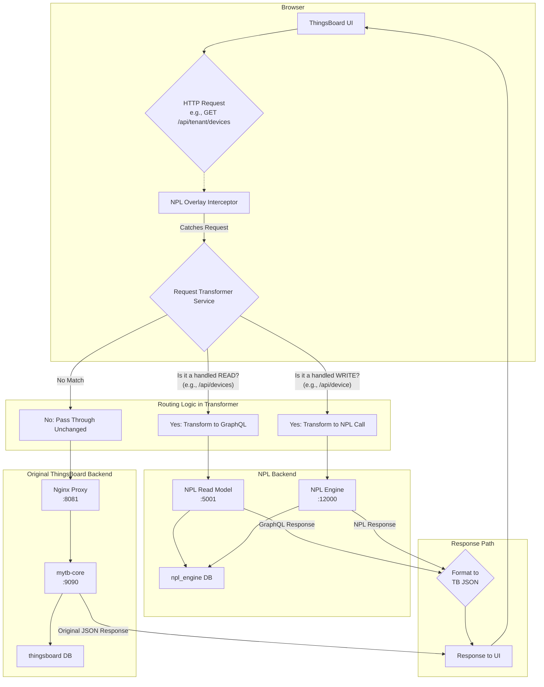

# NPL Modernization: Interceptor Overlay Integration Approach

## 1. Executive Summary

This document outlines the scalable, pattern-based approach for modernizing the ThingsBoard backend by incrementally replacing legacy API endpoints with new NPL (Noumena Protocol Language) services.

The core of this strategy is a **UI Interceptor Overlay**. This is a small, injectable frontend application that runs alongside the original ThingsBoard UI. It intercepts outgoing API calls from the user's browser and intelligently reroutes them to either the new NPL backend or the original ThingsBoard backend, based on a centralized routing configuration.

This approach allows for a gradual, feature-by-feature migration with minimal risk, requiring no changes to the legacy frontend codebase. The process is designed to be highly efficient and scalable for ongoing development.

---

## 2. The 3 Key Steps of the Process

The entire process can be broken down into three main stages: **Injection**, **Interception**, and **Transformation & Routing**.

### Step 1: Injection (via Nginx Proxy)

The overlay code is injected into the main ThingsBoard application at runtime.

-   The **Nginx Proxy** (`npl-proxy` service) acts as the entry point for all UI traffic.
-   When a user loads the application, Nginx serves the standard ThingsBoard UI but uses a `sub_filter` to dynamically inject a `<script>` tag pointing to our overlay bundle (`npl-overlay.js`) just before the closing `</body>` tag.
-   This ensures our custom code is loaded and executed within the context of the original ThingsBoard Angular application.

### Step 2: Interception (via Angular `HttpInterceptor`)

Once injected, the overlay "catches" all API calls before they are sent.

-   The `npl-overlay.js` bundle registers a standard **Angular `HttpInterceptor`**.
-   This interceptor acts as a middleware for *every single HTTP request* the UI makes.
-   It effectively gives our overlay the power to inspect, modify, and control every API call initiated by the frontend.

### Step 3: Transformation & Routing (via `RequestTransformerService`)

This is the "brain" of the overlay, where the decision-making happens. The `HttpInterceptor` passes every caught request to the `RequestTransformerService`, which follows a clear set of rules:

1.  **Is it a READ operation we want to handle?**
    -   The service checks if the request is a `GET` method and if the URL matches a predefined regex of read patterns (e.g., `/api/tenant/devices`, `/api/device/{id}`).
    -   **If it matches:** The request is transformed into a **GraphQL query**. This new query is sent to the **NPL Read Model**. The GraphQL response is then re-shaped into the exact JSON format the legacy ThingsBoard UI expects.

2.  **Is it a WRITE operation we want to handle?**
    -   The service checks if the request is a `POST`, `PUT`, or `DELETE` method and if its URL matches a predefined regex of write patterns (e.g., `/api/device`).
    -   **If it matches:** The request is transformed into an API call to the **NPL Engine** to execute the corresponding permission on the NPL protocol.

3.  **If it's neither of the above?**
    -   If the request URL doesn't match any of our modernization patterns (e.g., `/api/dashboards`), the transformer service does **nothing**.
    -   It passes the original, untouched request along to be handled by the legacy **`mytb-core`** backend.

---

## 3. Data Flow Diagram

This diagram illustrates the decision-making process for an API call originating from the browser.

---

## 4. Scalability & Maintainability

This approach was explicitly designed for scalability and ease of maintenance.

### How to Add a New Service/Endpoint

When a new NPL protocol is created (e.g., "Asset Management"), extending the overlay is a simple, localized process:

1.  **Create a dedicated GraphQL Service:** A new file (e.g., `asset-graphql.service.ts`) is created to hold the GraphQL queries for reading asset data. This keeps logic for each domain separate.
2.  **Update the Central Router (`request-transformer.service.ts`):**
    -   Add the new URL patterns (e.g., `/api/asset/...`) to the read/write regular expressions.
    -   Add a new `case` to the `switch` statement to call the new `asset-graphql.service.ts` functions.

No other part of the "plumbing" (Nginx, the interceptor, etc.) needs to be changed.

### Why This Approach is Easy to Scale

-   **Centralized Logic:** All routing rules are in one place.
-   **Predictable Pattern:** The process of adding a new endpoint is identical every time.
-   **Low Cognitive Load:** A developer only needs to know the legacy API endpoint and the new NPL/GraphQL equivalent, not the implementation details of the legacy system.

This predictable, pattern-based nature makes it an ideal task for automation, code generation, or an AI assistant to perform quickly and reliably. The initial investment in the overlay infrastructure makes all future modernization work highly efficient. 